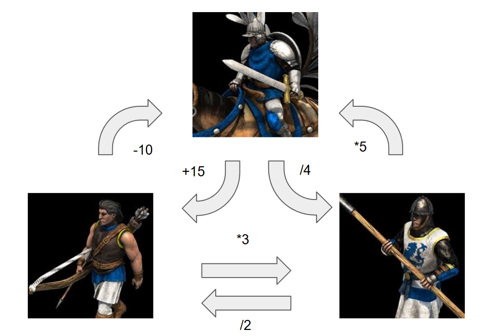

# CC3002-AOE-DD

En este ejercicio usted impementará la funcionalidad de ataque para las unidades del Age of Empires.

Para eso haga a las unidades extiendan de AbstractUnit y luego implemente los métodos que faltan utilizando double dispatch.  

Queda a elección suya cuánto daño hace cada unidad.

Considere las siguientes debilidades y fortalezas

o la siguiente tabla:

|     atk\def     | Infantry | Cavalry | Archer |
|----------|----------|---------|-------|
| Infantry |   dmg   |     dmg*5    |     dmg/2  |
| Cavalry  |    dmg/4      |     dmg    |  dmg+15     |
| Archer    |    dmg*3      |    dmg-10     |      dmg |
